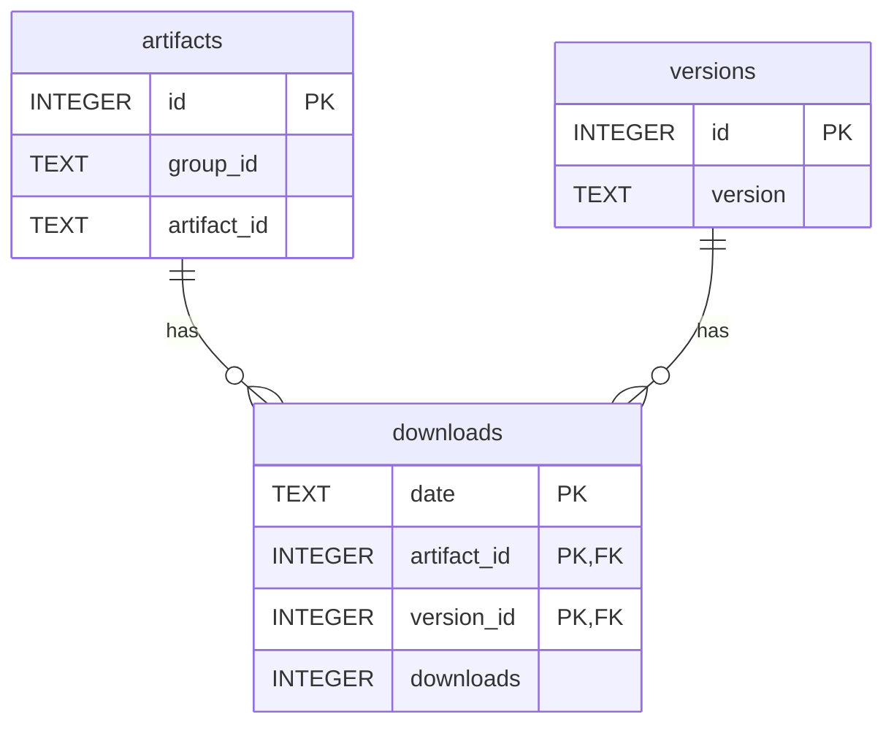

# Clojars Download Stats

A community mirror of Clojars download statistics (Nov 2012 - present).

## Why This Exists

Clojars publishes daily download stats. Fetching the full history takes a long time or hammers their servers. Therefore this repo provides up-to-date daily download stats as SQL exports, plus Babashka tasks that lets you create a fully populated sqlite database for your local querying. It takes a few minutes to do the import once you have cloned the repository to your machine.

## Database layout



## Usage

### Create your database

As of December 2025:
* Project size: ~8GB, mostly SQL files
* Import time: **~4 minutes** (36M rows)
* Database size: 2.9GB

```sh
# Clone the repo
git clone https://github.com/PEZ/clojars-download-stats
cd clojars-download-stats

# Create a local database from SQL exports
bb files.import ./clojars-downloads.sqlite

# Done! Query with your favorite SQLite tool
sqlite3 ./clojars-downloads.sqlite "SELECT * FROM artifacts LIMIT 5"
```

### Keeping Your Database Up To Date

After the initial import, just pull and reimport:

```sh
git pull
bb files.import ./clojars-downloads.sqlite
```

The import is incremental, reimporting only the missing month(s) with new data. A daily update takes seconds.

You can also fetch directly from Clojars to your database:

```sh
bb clojars.fetch ./clojars-downloads.sqlite
```

## For maintainers of the repoistory

### Tasks

```sh
# Database tasks (require SQLite)
bb files.import <db-path>           # SQL files → SQLite (incremental if DB exists)
bb db.export <db-path>              # Database → daily SQL files (slow, ~1 hour)
bb clojars.fetch <db-path>          # Fetch missing dates from Clojars → database
bb db.export.update <db-path>       # Fetch + export (for manual updates)
bb db.export.status <db-path>       # Show database and export status
bb db.export.generate-state <db-path> # Generate state.edn from database

# CI tasks (no database required, use state.edn)
bb clojars.export.update            # Fetch missing days → append to SQL files
bb clojars.export.day <date>        # Fetch one specific day → append to SQL files
bb db.export.status                 # Show state.edn summary (no args)
```

## Database Schema

Normalized schema storing ALL Clojars data with version granularity:

```sql
artifacts (id, group_id, artifact_id)                 -- ~34K unique libraries
versions (id, version)                                -- ~31K unique version strings
downloads (date, artifact_id, version_id, downloads)  -- ~36M rows
```

## SQL Export Format

Monthly files in `data/monthly/YYYY-MM.sql`:

```sql
-- 2024-12.sql
INSERT INTO artifacts (id, group_id, artifact_id) VALUES ...
INSERT INTO versions (id, version) VALUES ...
INSERT INTO downloads (date, artifact_id, version_id, downloads) VALUES ...
```

## How CI Updates Work

The CI workflow runs daily and uses `state.edn` to track ID mappings—no database rebuild required:

1. **Fetch** yesterday's Clojars stats via HTTP (or fill gaps if CI missed days)
2. **Assign IDs** for any new artifacts/versions using state.edn
3. **Append** SQL statements to the appropriate daily file
4. **Update** state.edn with new IDs
5. **Commit** changes to git

This makes daily updates fast (~1 second) and stateless.

## What Downloads Measure

Downloads primarily reflect CI cache misses (~90% weekday traffic), not direct human adoption. Relative comparisons across libraries are meaningful.

## Known missing data on Clojars

These dates have no data on Clojars

```
2015-12-27
2021-01-05 through 2021-01-22 (18 consecutive days)
2021-02-20, 2021-06-19, 2021-08-18, 2021-10-16
2022-01-15, 2022-02-13
2023-03-26, 2023-04-23, 2023-11-26
```

## License

MIT
